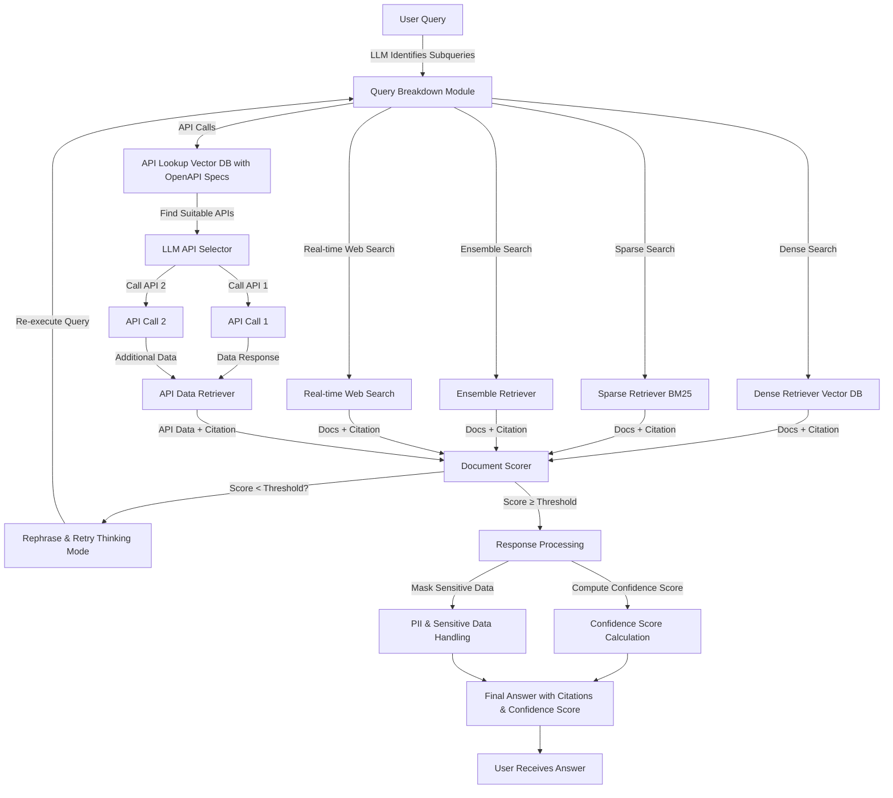
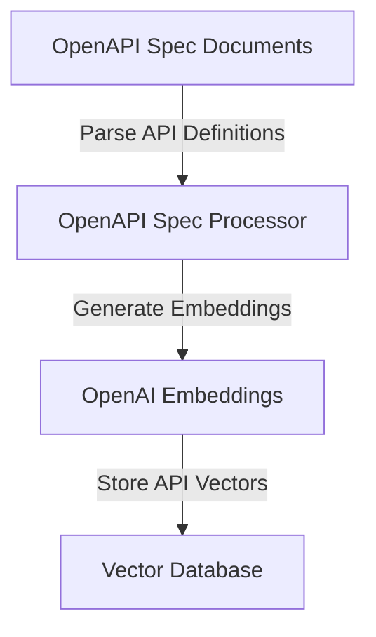
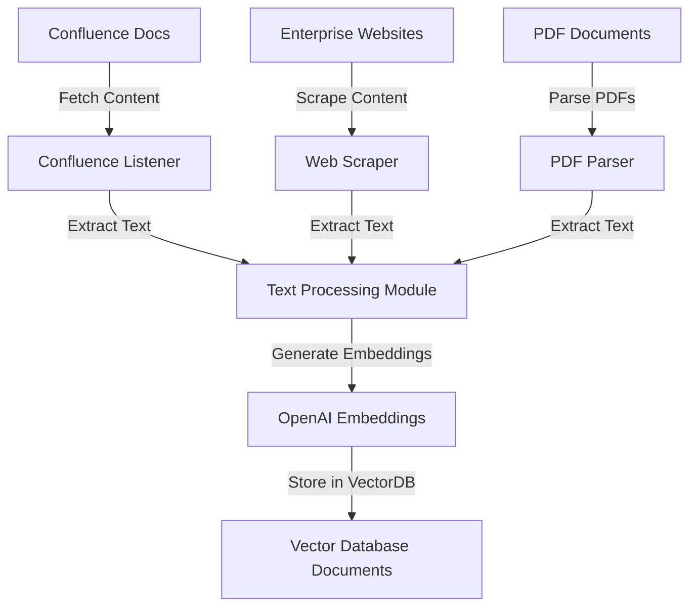

# AskVerse: Design & Architecture

## 1. Introduction

AskVerse is a **Secure, Scalable, and Real-time Knowledge Management System** leveraging a **Multi-Agentic Retrieval-Augmented Generation (RAG) Pipeline**. The system consists of multiple retrievers, real-time API orchestration, document scoring, uncertainty quantification, and access control mechanisms.

This document describes the **architecture and design** of the system, including:
- The **RAG pipeline workflow**
- **Publishing OpenAPI specs to VectorDB**
- **Publishing enterprise documents to VectorDB**

---

## 2. RAG Workflow (Multi-Agentic RAG Pipeline)

### **Description:**
- **Query Breakdown:** LLM decomposes complex queries into subqueries.
- **Multi-Retriever System:** Uses Dense, Sparse, Ensemble retrievers, and Web Search.
- **API Orchestration:** Finds and invokes APIs dynamically based on OpenAPI specs stored in Vector DB.
- **Document Scoring & Re-execution:** If results are poor, the system retries with rephrased queries.
- **Final Processing:** Adds citations, computes confidence scores, and masks sensitive data.

---

## 3. OpenAPI Specification Publisher

### **Description:**
- **Processes OpenAPI Specifications** to extract API definitions.
- **Generates vector embeddings** for each API.
- **Stores API vectors in VectorDB**, enabling dynamic API selection in the RAG pipeline.

---

## 4. Document Ingestion & Publishing to VectorDB

### **Description:**
- **Confluence Listener, Web Scraper, PDF Processor** extract data from various sources.
- **Text Processing Module** cleans and standardizes extracted content.
- **Embeddings are generated** using OpenAI models.
- **Processed documents are stored in VectorDB**, enabling retrieval in the RAG pipeline.

---

## 5. Conclusion

This design ensures:
- ✅ **Scalability** through multi-agent retrieval and API orchestration.
- ✅ **Security & Compliance** via access control and PII masking.
- ✅ **Accuracy & Transparency** by incorporating document scoring, citations, and confidence scores.
- ✅ **Real-time Adaptability** via OpenAPI-driven API selection and real-time web search.

This architecture supports a **highly extensible, plug-and-play knowledge management system** for enterprises.
