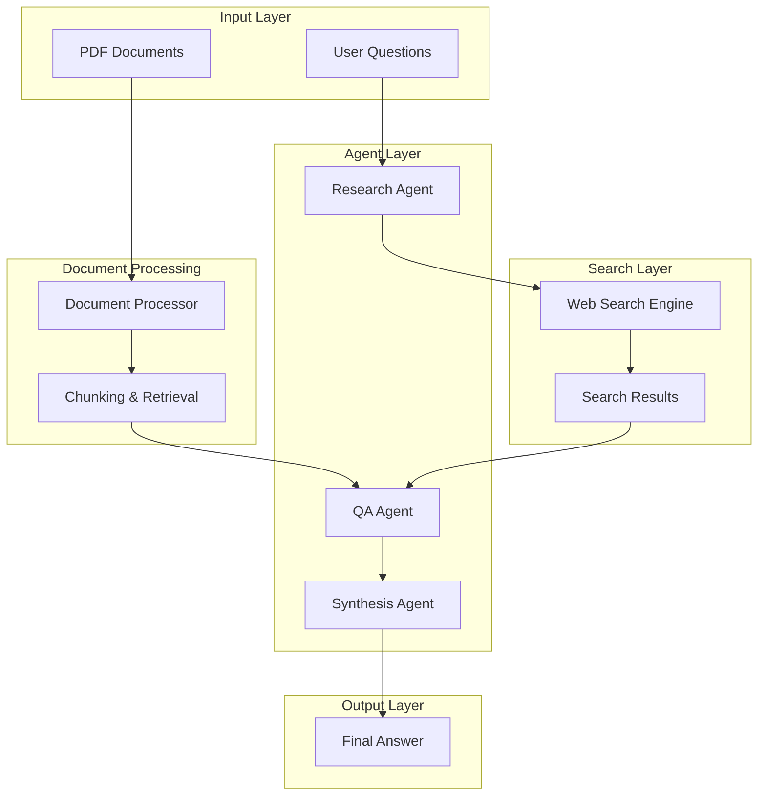
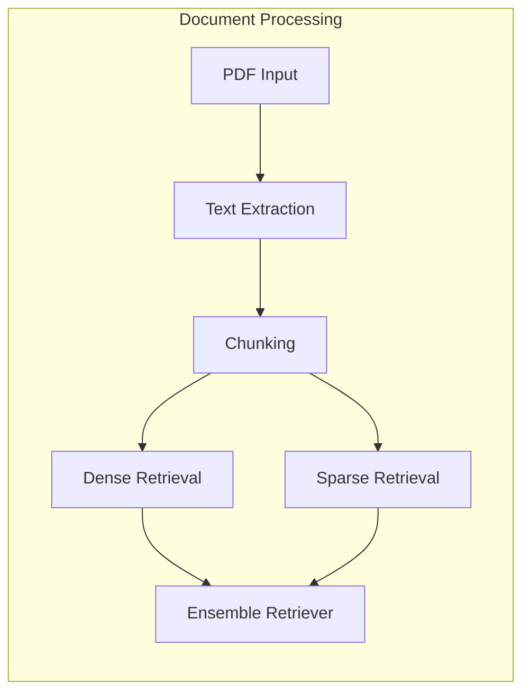
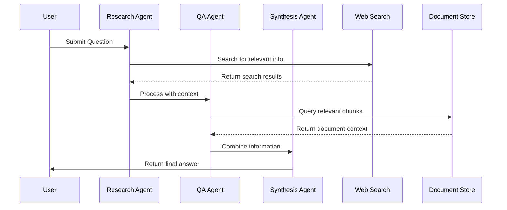
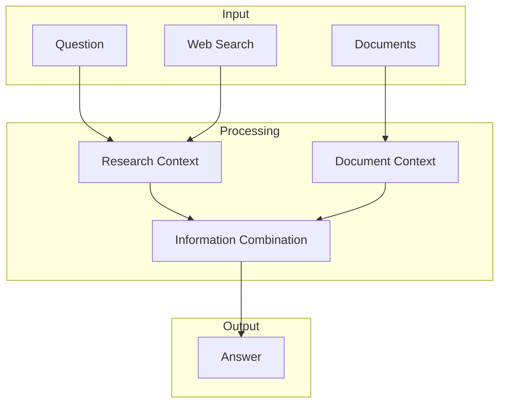
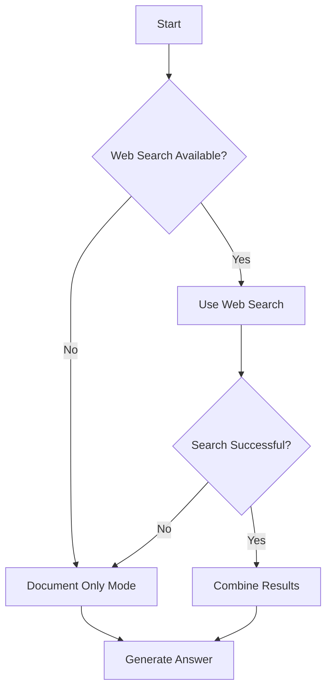
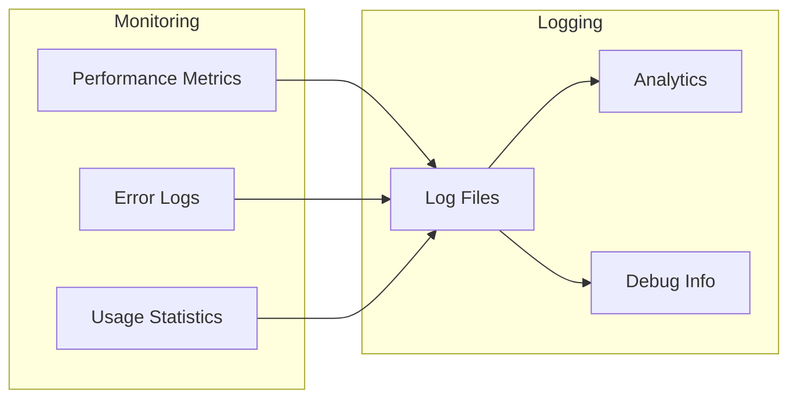

# AskVerse Mini - System Design Document

## Overview

AskVerse Mini is a sophisticated multi-agent AI system that combines document question answering with web search capabilities. The system uses a hybrid approach to provide comprehensive answers by leveraging both local document knowledge and real-time web search results.

## System Architecture

## Component Details

### 1. Document Processing Layer

The document processing layer handles the ingestion and preparation of PDF documents:

- **Text Extraction**: Converts PDF documents into plain text while preserving structure
- **Chunking**: Splits text into manageable chunks with overlap for context preservation
- **Hybrid Retrieval**:
  - Dense Retrieval: Uses OpenAI embeddings for semantic search
  - Sparse Retrieval: Uses BM25 for keyword-based search
  - Ensemble: Combines both approaches for better results

### 2. Agent Workflow

The system employs a multi-agent architecture with specialized agents:

#### Agent Roles

1. **Research Agent**
   - Handles web search queries
   - Filters and processes search results
   - Identifies relevant information gaps

2. **QA Agent**
   - Processes document chunks
   - Extracts relevant information
   - Combines document context with search results

3. **Synthesis Agent**
   - Merges information from multiple sources
   - Ensures consistency and coherence
   - Generates final comprehensive answer

### 3. Information Flow

## Response Enhancement Process

1. **Initial Question Processing**
   - Question is analyzed for required information types
   - System determines if web search is needed

2. **Parallel Information Gathering**
   - Document retrieval from local PDFs
   - Web search for current/relevant information
   - Both processes run concurrently for efficiency

3. **Information Integration**
   - Document context provides foundational knowledge
   - Web search results add current/relevant information
   - System identifies and resolves any contradictions

4. **Response Generation**
   - Information is synthesized into coherent answer
   - Sources are properly attributed
   - Response is formatted for clarity

## Error Handling and Fallbacks

## Performance Considerations

1. **Caching**
   - Document embeddings are cached
   - Frequently accessed chunks are stored in memory
   - Search results are cached temporarily

2. **Parallel Processing**
   - Document processing runs in parallel
   - Web search and document retrieval are concurrent
   - Agent operations are optimized for speed

3. **Resource Management**
   - Memory usage is monitored
   - Large documents are processed in chunks
   - Search results are limited to relevant content

## Future Enhancements

1. **Planned Improvements**
   - Support for more document types
   - Enhanced caching mechanisms
   - Improved search result filtering
   - Better source attribution

2. **Potential Features**
   - Multi-language support
   - Custom agent configurations
   - Advanced visualization options
   - API endpoint for integration

## Security Considerations

1. **API Key Management**
   - Secure storage of API keys
   - Environment variable usage
   - No hardcoded credentials

2. **Data Privacy**
   - Local document processing
   - Secure API communications
   - No data storage of sensitive information

## Monitoring and Logging

## Conclusion

AskVerse Mini's architecture combines the power of local document processing with real-time web search capabilities through a sophisticated multi-agent system. The design ensures efficient information processing, reliable response generation, and scalable operation while maintaining security and performance standards. 